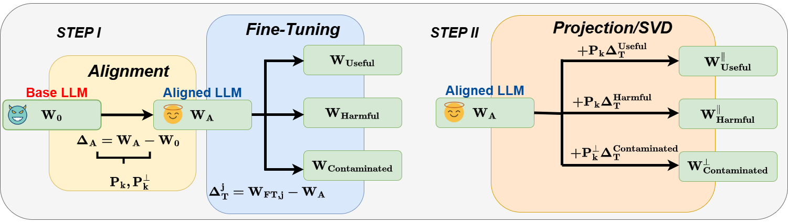

# Safety Subspaces are Not Distinct: A Fine-Tuning Case Study

## Introduction

Large Language Models (LLMs) rely on safety alignment to produce socially acceptable responses. This is typically achieved through instruction tuning and reinforcement learning from human feedback. However, this alignment is known to be brittle: further fine-tuning, even on benign or lightly contaminated data, can degrade safety and reintroduce harmful behaviors. A growing body of work suggests that alignment may correspond to identifiable geometric directions in weight space, forming subspaces that could, in principle, be isolated or preserved to defend against misalignment.
In this work, we conduct a comprehensive empirical study of this geometric perspective. We examine whether safety-relevant behavior is concentrated in specific subspaces, whether it can be separated from general-purpose learning, and whether harmfulness arises from distinguishable patterns in internal representations. Across both parameter and activation space, our findings are consistent: subspaces that amplify safe behaviors also amplify unsafe ones, and prompts with different safety implications activate overlapping representations. We find no evidence of a subspace that selectively governs safety.
These results challenge the assumption that alignment is geometrically localized. Rather than residing in distinct directions, safety appears to emerge from entangled, high-impact components of the model’s broader learning dynamics. This suggests that subspace-based defenses may face fundamental limitations and underscores the need for alternative strategies to preserve alignment under continued training. We corroborate these findings through multiple experiments on five open-source LLMs.



## Environment Setup

We use Conda to manage the Python environment. Set up your environment with:

```bash
conda create -n safety-spaces python=3.10
conda activate safety-spaces
pip install -r requirements.txt
```

## Experiments

### 1. Fine-Tuning

Generate baseline models with various training objectives:

```bash
bash scripts/finetune.sh
```

This creates fully useful, fully harmful, and contaminated model variants for our experiments.

### 2. Projection Analysis

Compute model projections across different SVD fraction values:

```bash
python scripts/projection.py
```

This generates a comprehensive CSV with utility and harmfulness metrics for each projection configuration.

### 3. Subspace Updating

Run:

```bash
bash exp-3-update_spaces/update_spaces.sh
```

### 4. Activation Space Analysis

Run:

```bash
python exp-4-activation_spaces/activation_space.py
```